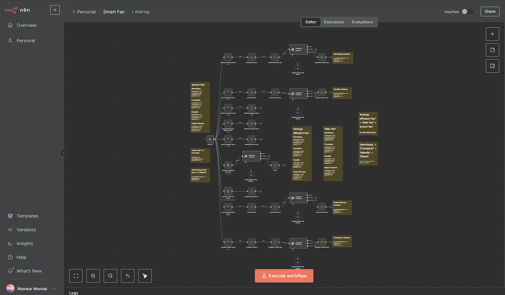

# Fan Sentiment and Share of Voice (SoV) Analysis

## Overview

This project is designed to track and analyze customer sentiment and Share of Voice (SoV) for various fan brands, specifically Atomberg, Havells, Crompton, and Orient Electric. The pipeline uses a combination of tools like SerpAPI, Google Custom Search Engine (CSE), Twitter API, and the Gemini Chat model for sentiment analysis. The ultimate goal is to compare the brands' SoV across different keywords and platforms, such as YouTube and Twitter, to understand public sentiment and engagement.

The workflow automates the following tasks:

- **Collecting customer reviews** from Flipkart for the brands: Atomberg, Havells, Crompton, and Orient Electric using SerpAPI.
- **Sentiment analysis** on these reviews using the Gemini Chat model.
- **Finding mentions on YouTube** for "smart fan" using Google CSE and calculating the number of mentions for Atomberg.
- **Sentiment analysis on Twitter** using the Twitter API for Atomberg smart fans.
- **Keyword-based analysis** for comparing the Share of Voice (SoV) of the brands using "bldc fans" and "energy efficient fans" as comparison keywords.

## Tech Stack

- **n8n**: An open-source workflow automation tool used to create the entire pipeline.
- **SerpAPI**: Used for scraping customer reviews and conducting searches on different keywords.
- **Gemini Chat Model**: Used to perform sentiment analysis on customer reviews and social media mentions.
- **Google Custom Search Engine (CSE)**: For searching YouTube for mentions of the "smart fan" keyword.
- **Twitter API**: To collect tweets and perform sentiment analysis for "Atomberg smart fans."
- **Python**: For additional analysis (if needed) and sentiment scoring, using libraries like `pandas` for data manipulation and `matplotlib` for visualizations.

## Setup and Installation

1. **Clone this repository**:
   ```bash
   git clone https://github.com/CyberRik/smart-fan.git
   cd smart-fan
   ```

2. **Install n8n**:
   If you don't have n8n installed, follow the instructions on the [n8n website](https://n8n.io/) to get it set up.

3. **Import the JSON Workflow**:
   - Inside your n8n instance, go to the **"Import"** section.
   - Upload the `smart fan.json` file from this repository.

4. **Configure APIs**:
   - You'll need to set up API keys for SerpAPI, Google CSE, and the Twitter API in your n8n workflow to fetch the necessary data.
   - Make sure to set up any other required environment variables or credentials.

5. **Run the Workflow**:
   Once your APIs are configured, trigger the workflow, and it will collect and analyze the data as described above.

## Workflow Details

1. **Customer Review Collection**:
   - **Source**: Flipkart
   - **Brands**: Atomberg, Havells, Crompton, Orient Electric
   - **API Used**: SerpAPI
   - **Goal**: Collect customer reviews and analyze sentiment using the Gemini Chat model.

2. **YouTube Mentions for "Smart Fan"**:
   - **Source**: YouTube via Google CSE
   - **Goal**: Find the number of mentions for Atomberg and calculate its Share of Voice.

3. **Twitter Mentions**:
   - **Source**: Twitter API
   - **Goal**: Analyze sentiment for mentions of "Atomberg smart fans."

4. **Keyword Analysis**:
   - **Keywords**: "bldc fans" and "energy efficient fans"
   - **Goal**: Compare the SoV across the brands using these additional keywords.

## Analysis and Insights

The analysis from the workflow will allow you to compare the **Share of Voice (SoV)** across different brands and keywords. This includes:

- The **number of mentions** each brand receives across the platforms.
- **Sentiment analysis** to understand the public’s positive or negative sentiment towards each brand.
- **Engagement metrics** to understand which brand receives the most attention and positive interactions.

## Findings and Recommendations

The findings can be viewed in the analysis report. Some potential recommendations could include:

1. **Content Strategy**: Focus on keywords with higher SoV for improved engagement.
2. **Brand Positioning**: Address negative sentiment by responding to customer feedback on social media platforms.

## Workflow Overview

Below is the workflow for tracking and analyzing customer sentiment and Share of Voice (SoV):



